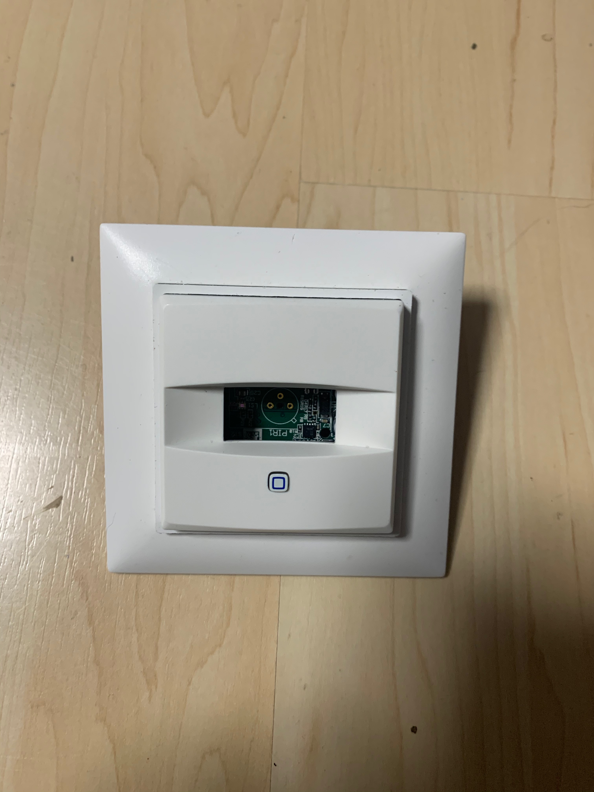
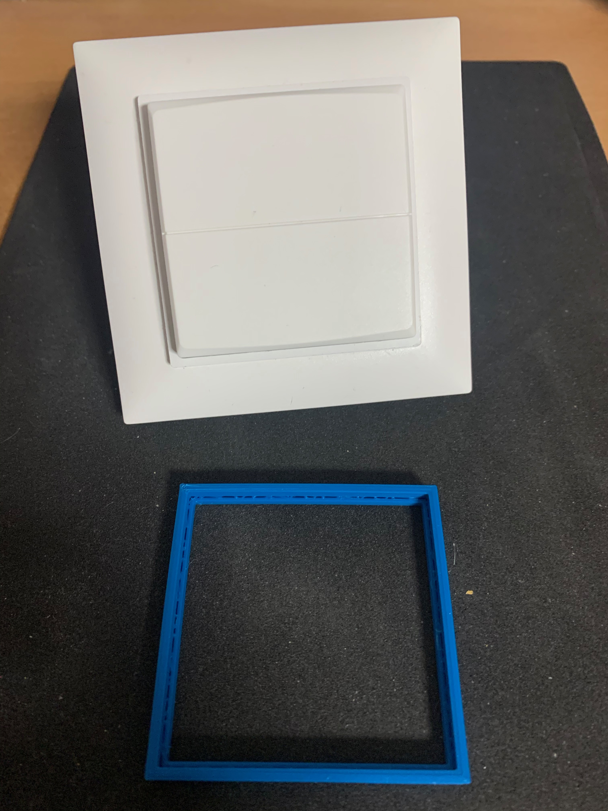
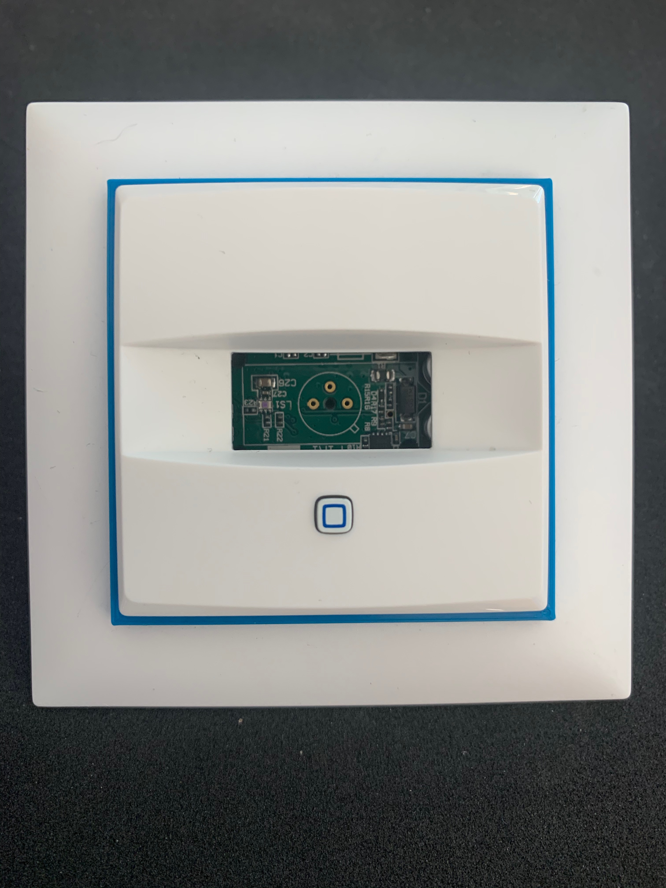
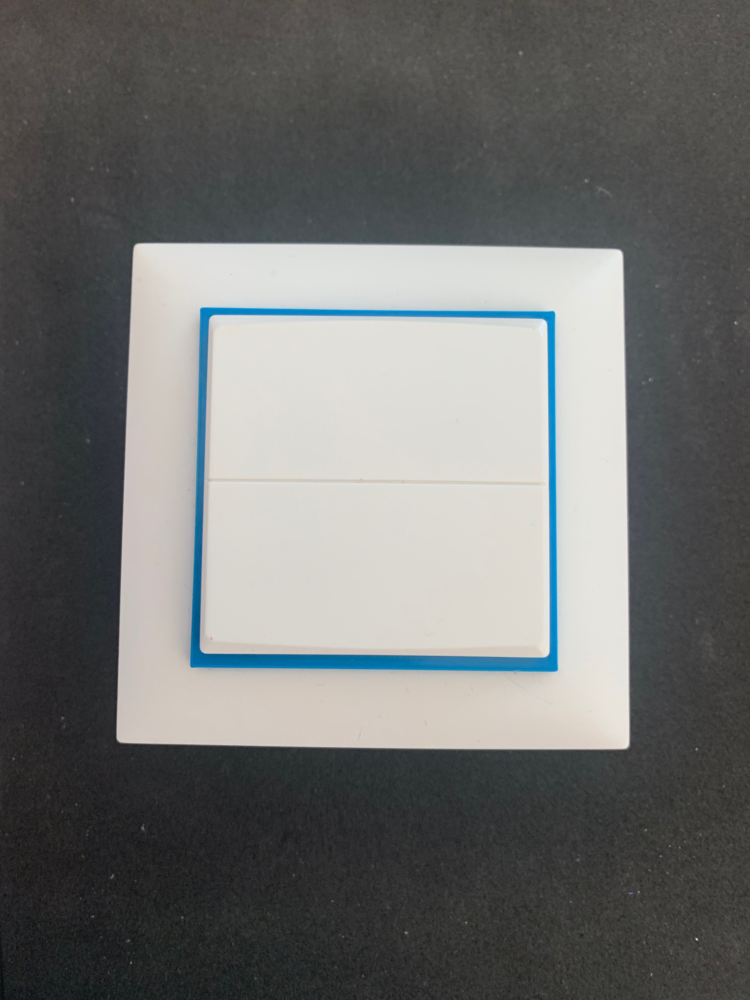
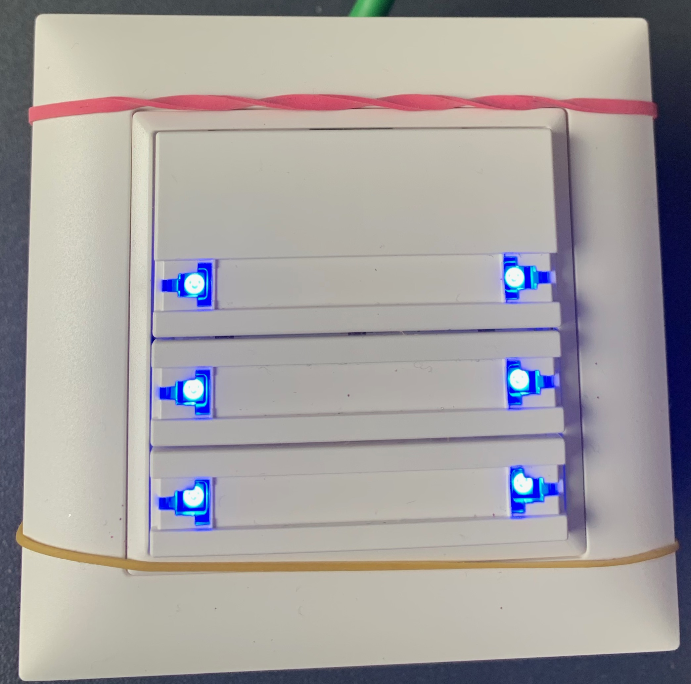

# Homematic and Feller

This repository describes the approach to integrate components from homematic into the switch programme of Feller. The switches from Feller are most used in Switzerland and the various types of switches are typically using a 60mm x 60mm.
The components from homematic are typically using frames of 56mm x56mm (55er Switches) and the modular switches are designed to work with most German industry switches.

Mechanically Feller provides switches which can mechanically configured as pushbuttons or as switchers.

Following appraoches have been tested successfully:

## Feller Edizio Due Switch configured as push button with HmIP-FSM16

  

There is enough space available to put the HMIP-FSM16 actuator behind the mechanical bushputtton.

## Feller Edizio Due Frame with 55er Switches from Homematic and Adapter from Brack

Youn need to cut the edges in the inner frame with a cutter or a saw.
From the [adapter kit](https://www.brack.ch/homematic-adapter-feller-ediziodue-fuer-wm55-geraete-195447) you can add then the spacer which reduces the 60mm x 60mm inner frame to 56mm x56mm.
As an alternative, you can use my stl file and print the spacer on a 3d printer.
Download this *[STL-File](stl/EdizioDueSpaceV3.stl)*.

There are following components available from Homematic:

1. Switch HmIP-SMI55, battery driven but could be complemented with a power supply (HmIP-BBS)
2. Switch HmIPW-SMI55 for HMIP Wired, bus driven
3. Switch HmIP-BSM which integrates nicely

There are many more 55er components, but most of them are too thick and therefore ugly.
e.g. HmIP-WRC6

## Feller Edizio Due / Uni in combination with Homematic universal switches HmIP-BSW

The Feller Switches have terminals which can be connected (soldered) to the upper platine in the Homematic HMIP-BSM Switch. Best to buy the kit and not the complete switch. The 2 mini switches need to be removed and small wires soldered. This is not really difficult, but it is a bit of pain.

If you do not need to actually switch current locally but only remotely this approach could be followed with the HmIP-FCI6 (but only battery driven) This would save soldering but gives you some headaches for the power supply.

The HMIP-BSM and similar components cannot be integrated mechanically into the Feller Programm nicely and there are no adapters available. The adapters which have been created by 3rd Parties are just not comfortable to customize. It is probably a dead end from a design perspective.

## Feller Edizio Due / Uni in combination with Homematic Wired Switch HmIPW-FIO6

In this combination you get a great system which can react and display a status with the blue LEDs.
I have soldered a 10k Ohm Resistor to protect the LEDs.
1. HmIPW-FIO6

## Open Wishes
1. A not wired component like the HmIPW-FIO6 which can be driven by 230V.
2. A simple sender which can transmit a voltage between 0...10V

  

